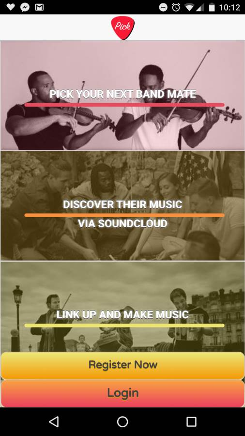
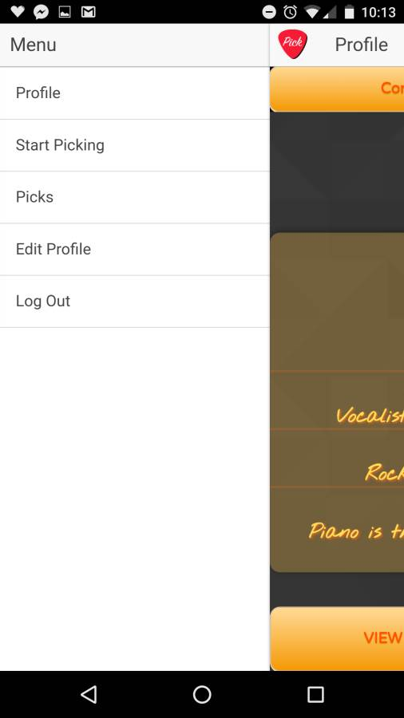
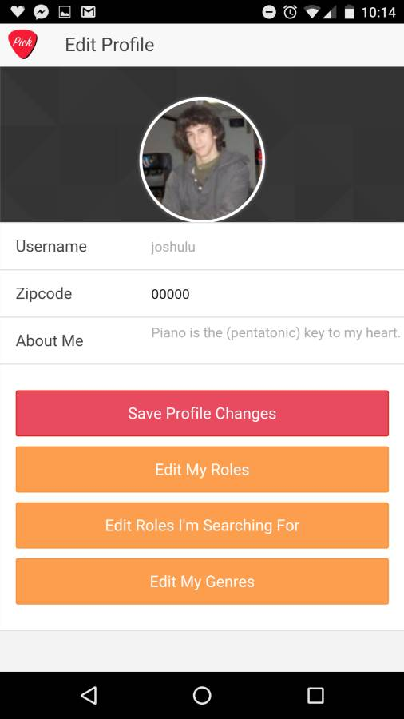
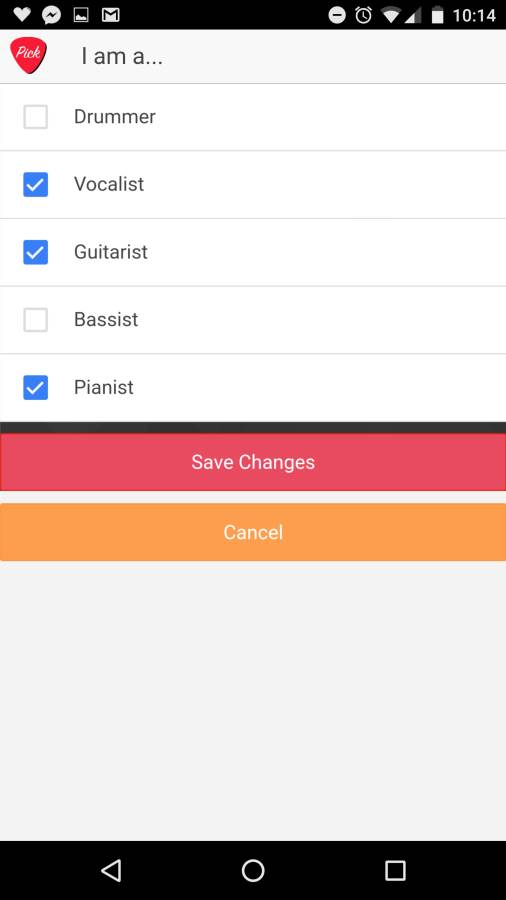
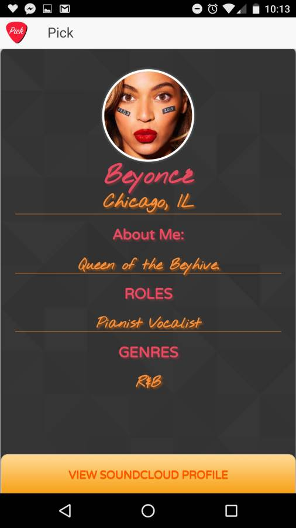
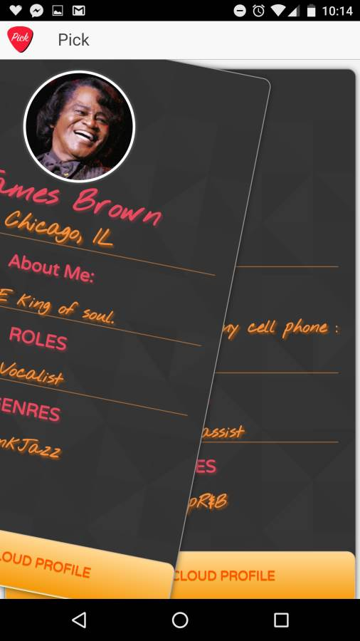
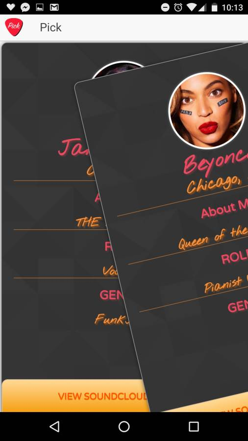

# pick-mobile

This is the front-end of our mobile app, Pick. It was built in AngularJS and Ionic, and it provides an Android and iOS compatible user interface. The back end is built in Rails 4, and uses a zipcode API and Soundcloud's API for location filtering and user profile information. The back-end was tested with RSpec.

The app allows local musicians to connect with one another based on musical talents, preferred genre, and location.

Users are shown a shuffled deck of user profile 'cards' based on their search criteria. Profile cards have users' genres, musical talents, and Soundcloud info on them. 

If a user swipes right on a card, the app records that as a sign of interest. If they swipe left, the app places the card back in the deck in case the user changes their mind later on.

When two users swipe right on each other, they can see each others' profiles in the 'Picks' tab. From here, users can view the Soundcloud profiles of their 'Picks' and send messages to each other using Soundcloud.

The app is not currently deployed to the Google Play Store or IOS App Store, but will be in the near future!

> The launch page upon opening the app

> User's profile page

> The pick icon doubles as the menu button.

> The same user's profile editor

> Editing user's roles with prepopulated checkboxes

> Editing roles we're looking for (similar to above)

> The soundcloud profile attatched to the user

> The first card in our deck of potential musicians based on our search criteria and location

> We can swipe left to pass

> And right to approve

> When both parties have swiped right (Approved) we can see the match made here
