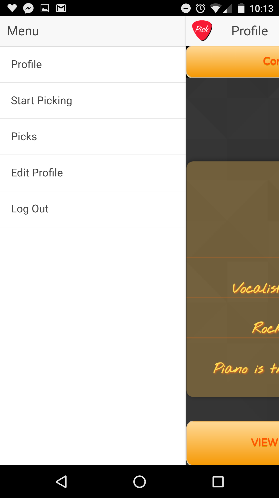
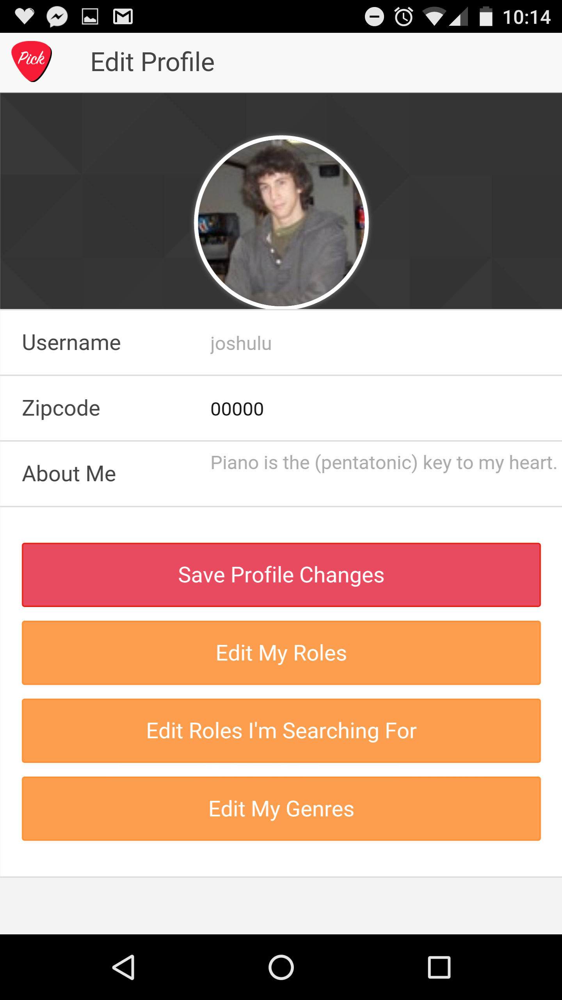
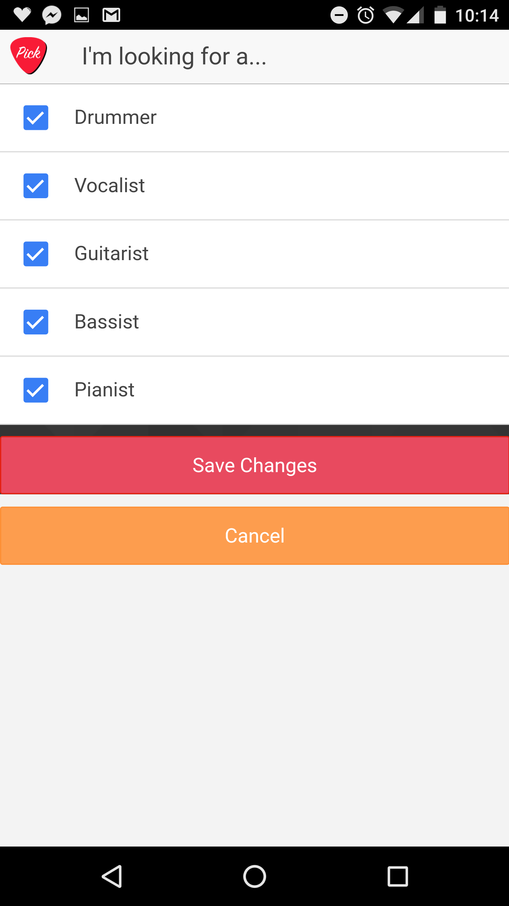
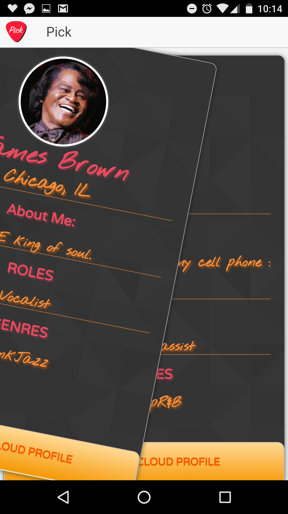

# pick-mobile

The  app allows local musicians to connect with one another.

This is the front-end of our mobile app, Pick. It was build in AngularJS and Ionic, and it provides an Android and iOS compatible user interface.

